# API Documentation

> **Base URL:** `http://localhost:8000`
>
> **Interactive Docs:** [`/docs`](http://localhost:8000/docs) (Swagger UI) · [`/redoc`](http://localhost:8000/redoc) (ReDoc)

---

## Table of Contents

- [System](#1-system)
  - [GET /health](#get-health)
  - [GET /ui](#get-ui)
- [Enrollment](#2-guided-multi-pose-enrollment)
  - [POST /enroll/start](#post-enrollstart)
  - [POST /enroll/frame/{session_id}](#post-enrollframesession_id)
  - [POST /enroll/retake/{session_id}](#post-enrollretakesession_id)
- [Verification](#3-face-verification)
  - [POST /verify](#post-verify)
- [Error Reference](#error-reference)
- [Enrollment Flow Diagram](#enrollment-flow-diagram)

---

## 1. System

### `GET /health`

Health check endpoint. Returns service status and configuration.

**Response `200 OK`**

```json
{
  "status": "ok",
  "model": "ArcFace",
  "threshold": 0.6,
  "enrollment_poses": ["front", "left", "right", "up", "down"]
}
```

| Field | Type | Description |
|:---|:---|:---|
| `status` | string | Always `"ok"` if the service is running |
| `model` | string | Face recognition model in use |
| `threshold` | float | Similarity threshold for match decisions (0–1) |
| `enrollment_poses` | string[] | Required poses in enrollment order |

---

### `GET /ui`

Serves the live test UI ([test_ui.html](file:///c:/Users/HiTech/Desktop/FaceVerification/test_ui.html)). Opens directly in the browser.

**Response:** `200 OK` — `text/html`

---

## 2. Guided Multi-Pose Enrollment

The enrollment process uses a **session-based** flow. The client starts a session, then submits camera frames one at a time. The server validates each frame against the expected head pose and advances the session automatically.

> [!IMPORTANT]
> Sessions expire after **15 minutes** of inactivity. Abandoned sessions are purged automatically.

### `POST /enroll/start`

Begin a new enrollment session for a candidate.

**Request** — `multipart/form-data`

| Field | Type | Required | Description |
|:---|:---|:---|:---|
| `candidate_id` | string | ✅ | Unique identifier for the candidate |

**Response `200 OK`**

```json
{
  "session_id": "a1b2c3d4-e5f6-7890-abcd-ef1234567890",
  "candidate_id": "john_doe_2026",
  "required_poses": ["front", "left", "right", "up", "down"],
  "total_poses": 5,
  "message": "Session started. First pose: FRONT"
}
```

| Field | Type | Description |
|:---|:---|:---|
| `session_id` | string (UUID) | Pass this to all subsequent `/enroll` calls |
| `candidate_id` | string | Echo of the provided candidate ID |
| `required_poses` | string[] | Ordered list of poses to capture |
| `total_poses` | integer | Total number of poses required |
| `message` | string | Human-readable status message |

**Error Responses**

| Status | Condition |
|:---|:---|
| `409 Conflict` | Candidate is already registered |

---

### `POST /enroll/frame/{session_id}`

Submit one camera frame for the current required pose. The server validates the frame through a multi-step pipeline.

**Path Parameters**

| Parameter | Type | Description |
|:---|:---|:---|
| `session_id` | string (UUID) | Session ID from `/enroll/start` |

**Request** — `multipart/form-data`

| Field | Type | Required | Description |
|:---|:---|:---|:---|
| `frame` | file | ✅ | Image file (JPEG/PNG) from camera |

**Validation Pipeline**

```
Frame → Image Quality → Face Detection → Pose Match → Embedding Extraction → Store
```

**Response `200 OK`** — The `status` field indicates the result:

#### Status: `pose_captured`

The frame was accepted and the session advances to the next pose.

```json
{
  "status": "pose_captured",
  "captured_pose": "front",
  "poses_done": 1,
  "poses_remaining": 4,
  "next_pose": "left",
  "message": "✓ Front captured! Now: LEFT"
}
```

#### Status: `enrollment_complete`

All 5 poses have been captured. The averaged reference embedding is stored.

```json
{
  "status": "enrollment_complete",
  "candidate_id": "john_doe_2026",
  "poses_captured": ["front", "left", "right", "up", "down"],
  "message": "All poses captured. Reference embedding stored successfully."
}
```

#### Status: `wrong_pose`

A face was detected but the head orientation doesn't match the required pose. **No retake is charged** — the user just needs to adjust.

```json
{
  "status": "wrong_pose",
  "target_pose": "left",
  "detected_pose": "front",
  "angles": { "yaw": -5.2, "pitch": 3.1 },
  "retakes_used": 0,
  "retakes_remaining": 5,
  "message": "Please turn your head LEFT. Currently detected: front."
}
```

#### Status: `no_face`

No face was detected in the frame. **1 retake is charged.**

```json
{
  "status": "no_face",
  "target_pose": "front",
  "retakes_used": 1,
  "retakes_remaining": 4,
  "reason": "No face detected. Ensure your face is fully visible."
}
```

#### Status: `invalid_quality`

The image failed quality checks (too small or too blurry). **1 retake is charged.**

```json
{
  "status": "invalid_quality",
  "target_pose": "front",
  "retakes_used": 1,
  "retakes_remaining": 4,
  "reason": "Image is too blurry (variance=12.3, minimum=30.0)."
}
```

#### Status: `extraction_failed`

Face was detected but the ArcFace model could not extract an embedding. **1 retake is charged.**

```json
{
  "status": "extraction_failed",
  "target_pose": "front",
  "retakes_used": 1,
  "retakes_remaining": 4,
  "reason": "Face recognition model error: ..."
}
```

> [!WARNING]
> Each pose allows a maximum of **5 retakes** (for charged failures only). Exceeding this limit terminates the session with a `400` error.

**Error Responses**

| Status | Condition |
|:---|:---|
| `400 Bad Request` | Session already complete, or retake limit exceeded |
| `404 Not Found` | Session ID not found or expired |

---

### `POST /enroll/retake/{session_id}`

Rewind the session to re-capture a specific pose. Use this when a previously accepted frame had issues (e.g. the user blinked).

**Path Parameters**

| Parameter | Type | Description |
|:---|:---|:---|
| `session_id` | string (UUID) | Session ID from `/enroll/start` |

**Request** — `multipart/form-data`

| Field | Type | Required | Description |
|:---|:---|:---|:---|
| `pose` | string | ✅ | Pose to retake: `front`, `left`, `right`, `up`, or `down` |

**Response `200 OK`**

```json
{
  "status": "retake_ready",
  "session_id": "a1b2c3d4-e5f6-7890-abcd-ef1234567890",
  "pose": "front",
  "message": "Ready to retake pose: FRONT"
}
```

**Error Responses**

| Status | Condition |
|:---|:---|
| `400 Bad Request` | Invalid pose value, or pose not in required sequence |
| `404 Not Found` | Session ID not found or expired |

---

## 3. Face Verification

### `POST /verify`

Compare a snapshot image against a registered candidate's stored face embedding. The result is logged to `verification_log.json`.

**Request** — `multipart/form-data`

| Field | Type | Required | Description |
|:---|:---|:---|:---|
| `candidate_id` | string | ✅ | ID of the registered candidate |
| `snapshot` | file | ✅ | Snapshot image (JPEG/PNG) to verify |

**Response `200 OK`**

```json
{
  "candidate_id": "john_doe_2026",
  "similarity_score": 78.43,
  "matched": true,
  "label": "MATCHED"
}
```

| Field | Type | Description |
|:---|:---|:---|
| `candidate_id` | string | Echo of the provided candidate ID |
| `similarity_score` | float | Cosine similarity percentage (0–100) |
| `matched` | boolean | `true` if score ≥ threshold × 100 |
| `label` | string | `"MATCHED"` or `"NON-MATCHED"` |

**Error Responses**

| Status | Condition |
|:---|:---|
| `400 Bad Request` | Multiple faces detected in snapshot |
| `404 Not Found` | Candidate is not registered |
| `422 Unprocessable Entity` | No face detected, or image cannot be decoded |
| `500 Internal Server Error` | Face recognition model error |

---

## Error Reference

All error responses follow this structure:

```json
{
  "detail": "Human-readable error description."
}
```

### Image Validation Errors (apply to enrollment frames and verification snapshots)

| Status | Detail | Cause |
|:---|:---|:---|
| `400` | `Image too small (WxH). Minimum dimension is 80px.` | Image width or height below 80px |
| `400` | `Image is too blurry (variance=X, minimum=30.0).` | Laplacian variance below threshold |
| `400` | `Multiple faces detected (N). Please upload an image with a single face.` | More than one face in the image |
| `422` | `Unable to decode the uploaded image.` | Corrupt or unsupported image format |
| `422` | `No face detected in the uploaded image.` | No face found by detector |
| `500` | `Face recognition model error: ...` | ArcFace model failure |
| `500` | `Unexpected error during face detection: ...` | Unhandled exception |

### Session Errors

| Status | Detail | Cause |
|:---|:---|:---|
| `400` | `This enrollment session is already complete.` | Frame submitted after completion |
| `400` | `Too many failed attempts (5) for pose '...'. Enrollment session terminated.` | Retake limit exceeded |
| `404` | `Enrollment session not found or expired.` | Invalid or expired session ID |
| `409` | `Candidate '...' is already registered.` | Duplicate enrollment attempt |

---

## Enrollment Flow Diagram

```mermaid
sequenceDiagram
    participant C as Client
    participant S as Server

    C->>S: POST /enroll/start (candidate_id)
    S-->>C: session_id, required_poses

    loop For each pose (front → left → right → up → down)
        C->>S: POST /enroll/frame/{session_id} (frame)
        alt Pose matches
            S-->>C: status: "pose_captured", next_pose
        else Wrong pose
            S-->>C: status: "wrong_pose" (no retake charged)
            C->>S: POST /enroll/frame/{session_id} (retry)
        else No face / bad quality
            S-->>C: status: "no_face" or "invalid_quality" (retake charged)
            C->>S: POST /enroll/frame/{session_id} (retry)
        end
    end

    S-->>C: status: "enrollment_complete"
    Note over S: Reference embedding stored

    rect rgb(40, 40, 60)
        Note over C,S: Verification Phase
        C->>S: POST /verify (candidate_id, snapshot)
        S-->>C: similarity_score, matched, label
    end
```


