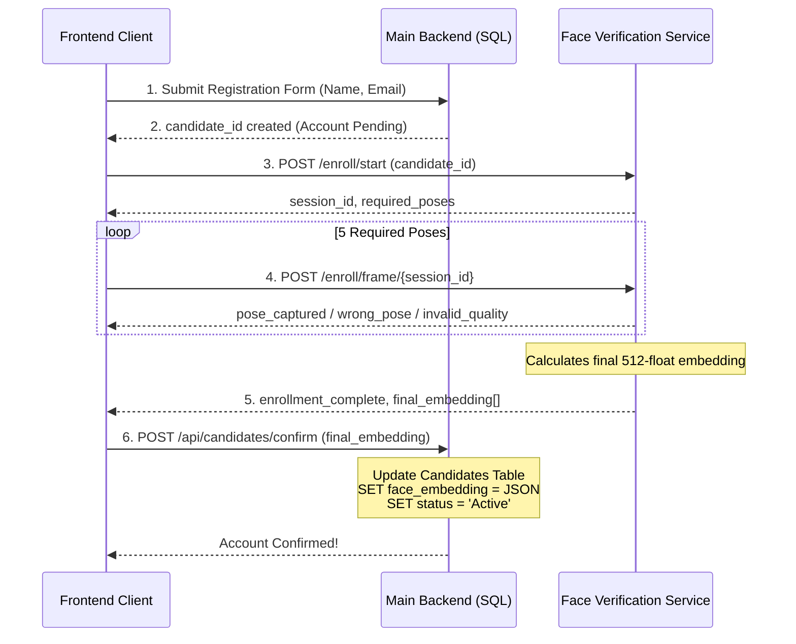
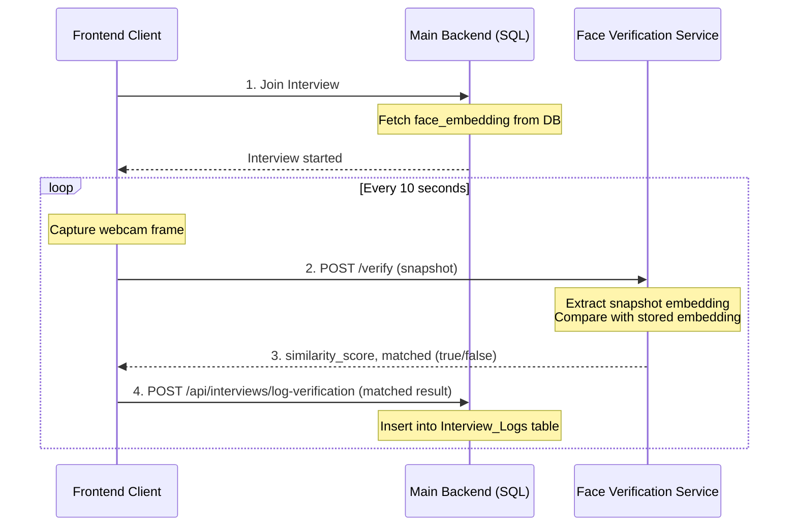

# Face Verification Integration Guide

This document outlines how the **Face Verification Microservice** integrates into the broader **Recruitment System**. It covers the end-to-end data flow during candidate registration (enrollment) and during live interviews (verification).

---

## 1. System Architecture Overview

The system consists of two primary backend components that communicate with the frontend client:

1. **Main Recruitment Backend:** Handles business logic, job applications, interview scheduling, and the primary SQL Database (containing the `Candidates` and `Interviews` tables).
2. **Face Verification Service:** A specialized FastAPI microservice that handles GPU/CPU-intensive AI tasks (DeepFace, ArcFace, RetinaFace) to generate and compare face embeddings.

> [!NOTE]
> The Face Verification Service does **not** directly connect to the main SQL database. Instead, it acts as a stateless processing engine. The Main Backend is responsible for storing and retrieving the embeddings.

---

## Phase 1: Candidate Registration & Face Enrollment

During registration, the candidate provides their basic information, followed by a guided multi-pose camera session to generate their unique face embedding.

### Process Flow

1. **Basic Registration:** The candidate fills out the registration form (Name, Email, Password) on the frontend.
2. **Create Candidate Record:** The frontend sends this data to the Main Backend. The Main Backend creates a new row in the `Candidates` table and generates a unique `candidate_id` (e.g., `CAND-1029`). The account is currently marked as *Pending/Unconfirmed*.
3. **Start Enrollment:** The frontend sends a `POST /enroll/start` request to the Face Verification Service using the `candidate_id`. The service returns a `session_id`.
4. **Capture Frames:** The frontend UI guides the candidate through the required head poses (Front, Left, Right, Up, Down). For each pose, the frontend sends a frame via `POST /enroll/frame/{session_id}`.
5. **Generate Embedding:** Once the 5th pose is captured, the Face Verification Service calculates the averaged 512-float **reference embedding** and returns it in the final `enrollment_complete` response.
6. **Confirm Account & Store:** The frontend takes this final embedding array and sends it to the Main Backend (e.g., `POST /api/candidates/{candidate_id}/confirm`). The Main Backend converts the array to a JSON string and saves it in the `Candidates` table, marking the account as *Active*.

### Sequence Diagram



---

## Phase 2: Job Interview & Face Verification

When a candidate starts an interview, the system continuously verifies that the person in front of the camera matches the registered candidate.

### Process Flow

1. **Start Interview:** The candidate joins the interview room on the frontend. The frontend requests the interview details from the Main Backend.
2. **Fetch Stored Embedding:** The Main Backend queries the `Candidates` table for the `candidate_id`, retrieves the stored `face_embedding` (JSON string), and parses it back into an array.
3. **Provide Embedding to Service:** *Implementation detail: Because the Face Verification Service is stateless, the frontend or Main Backend must pass the stored embedding alongside the camera snapshot for comparison.*
4. **Periodic Capture (Every 10s):** Every 10 seconds, the frontend quietly captures a frame from the webcam.
5. **Verify Match:** The frontend sends a `POST /verify` request to the Face Verification Service. The request includes the newly captured snapshot and the candidate's known `candidate_id`.
6. **Log Result:** The Face Verification Service calculates the similarity score (Match / Non-Match). The frontend receives this result and sends it to the Main Backend to log in the `Interviews` or `Interview_Logs` table.

### Sequence Diagram



---

## Database Schema Recommendations

The Main Backend's SQL Database needs to store the embeddings and log the interview results.

### `Candidates` Table
Use a `JSON` or `TEXT` column to store the 512-float embedding array.

```sql
CREATE TABLE Candidates (
    candidate_id VARCHAR(50) PRIMARY KEY,
    name VARCHAR(100),
    email VARCHAR(100),
    status VARCHAR(20) DEFAULT 'Pending',
    face_embedding JSON  -- Use NVARCHAR(MAX) in SQL Server, TEXT in SQLite
);
```

### `Interview_Verification_Logs` Table
Stores the results of the 10-second interval checks during an interview.

```sql
CREATE TABLE Interview_Verification_Logs (
    log_id INT AUTO_INCREMENT PRIMARY KEY,
    interview_id VARCHAR(50),
    candidate_id VARCHAR(50),
    timestamp DATETIME DEFAULT CURRENT_TIMESTAMP,
    similarity_score DECIMAL(5,2),  -- e.g., 85.43
    is_match BOOLEAN                -- 1 (True) or 0 (False)
);
```

---

## Integration Checklist & Next Steps

To fully connect the Face Verification service to the Main Backend, the following minor updates should be made to the current AI codebase:

1. **Refactor `/enroll/frame` (Phase 1):** Update the `enrollment_complete` response to return the actual `[0.12, 0.34...]` array so the frontend can send it to the Main Backend. Currently, the code saves it to a local `embeddings.json` file.
2. **Refactor `/verify` (Phase 2):** Since the `embeddings.json` file will be removed in favor of the main SQL database, the `/verify` endpoint needs to accept the *stored embedding array* directly in the request payload (or rely on the Main Backend to proxy the request and attach the embedding).
3. **Security:** Put the Face Verification Service behind your VPC / Internal network. Ensure strict CORS policies so only your main frontend domain can trigger the camera endpoints.
