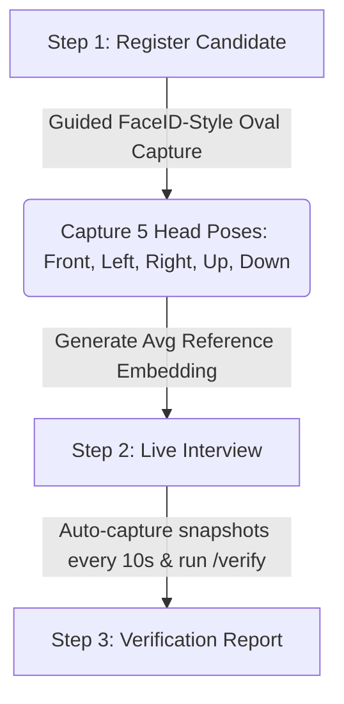

# AI Identity Verification Module

A standalone FastAPI service combined with a premium web frontend for face registration and identity verification. It implements a **FaceID-style guided multi-pose enrollment** process and continuous snapshot verification during live sessions using **ArcFace** embeddings.

---

## Technical Stack

| Component | Choice | Description / Reason |
| :--- | :--- | :--- |
| **Backend Framework** | FastAPI | High-performance, asynchronous Python web framework |
| **Frontend** | HTML5 / JavaScript (Vanilla) | Highly responsive UI with WebRTC camera streaming and canvas manipulation |
| **Face Recognition Model** | ArcFace (via DeepFace) | State-of-the-art accuracy for facial embedding comparison |
| **Face Detector Backend** | RetinaFace | Extremely robust for multi-angle/head-pose detection |
| **Similarity Metric** | Cosine Similarity | Standard scale-invariant comparison of 512-d embeddings |
| **Decision Threshold** | 0.60 (60%) | Balanced similarity threshold for identity matching |
| **Storage** | Local JSON database | Lightweight local storage for embeddings and verification logs |

---

## Project Structure

```
FaceVerification/
├── main.py               # FastAPI app setup: lifespan, CORS, router registration, /health, /ui
├── core.py               # Shared constants, models, and helper functions (image, pose, embedding)
├── routers/
│   ├── __init__.py
│   ├── enroll.py         # Guided multi-pose enrollment endpoints (/enroll/*)
│   └── verify.py         # Face verification endpoint (/verify)
├── test_ui.html          # Web UI frontend: WebRTC camera, FaceID oval overlay, & dashboard
├── requirements.txt      # Project Python dependencies
├── README.md             # Project documentation (this file)
└── local_db/             # Created automatically on first run
    ├── embeddings.json   # Registered candidate face embeddings (averaged across 5 poses)
    └── verification_log.json # Verification attempt logs (similarity scores & match outcomes)
```

---

## Setup & Run

### 1. Install Dependencies
Make sure you have Python 3.10+ installed. Install the dependencies listed in `requirements.txt`:
```bash
pip install -r requirements.txt
```

### 2. Start the Server
Run the FastAPI app using Uvicorn:
```bash
uvicorn main:app --reload --port 8000
```

### 3. Access the Application
* **Interactive Frontend Test UI:** [http://localhost:8000/ui](http://localhost:8000/ui) (Use this to test the entire registration and live interview verify flow in your browser).
* **Interactive Swagger API Docs:** [http://localhost:8000/docs](http://localhost:8000/docs) (Use this to inspect or test endpoints directly).

---

## Web UI Workflow

The web frontend (`/ui`) walks users through a premium three-step authentication process:



1. **Step 1: Register**
   * Grant camera permissions and start the Face Capture.
   * Position your face inside the **FaceID-style SVG oval overlay**.
   * Follow instructions to rotate your head in 5 directions: **Straight/Forward**, **Left**, **Right**, **Up**, and **Down**.
   * Upon completing the sequence, the 5 valid frames are processed, averaged into an L2-normalized reference embedding, and stored.

2. **Step 2: Live Interview**
   * Simulates an online assessment session.
   * A background timer automatically captures a webcam snapshot every 10 seconds and submits it to `/verify`.
   * Real-time match feedback (score, status, timestamp) is displayed in a feed.

3. **Step 3: Results Dashboard**
   * Once you click "Stop Interview", the system generates a summary gauge showing the overall match score, total snapshots analyzed, and final verification result (`MATCHED` or `NON-MATCHED`).

---

## API Endpoints Reference

### 1. System & Frontend UI

* **`GET /health`**
  * Check backend service status and configurations.
  * **Response:**
    ```json
    {
      "status": "ok",
      "model": "ArcFace",
      "threshold": 0.6,
      "enrollment_poses": ["front", "left", "right", "up", "down"]
    }
    ```

* **`GET /ui`**
  * Serves the live [test_ui.html](file:///c:/Users/HiTech/Desktop/FaceVerification/test_ui.html) test interface.

---

### 2. Guided Multi-Pose Enrollment

* **`POST /enroll/start`**
  * Initiates a guided enrollment session for a candidate.
  * **Form Parameters:**
    * `candidate_id` (string, required): A unique identifier for the candidate.
  * **Response:**
    ```json
    {
      "session_id": "uuid-string-here",
      "candidate_id": "candidate_123",
      "required_poses": ["front", "left", "right", "up", "down"],
      "total_poses": 5,
      "message": "Session started. First pose: FRONT"
    }
    ```

* **`POST /enroll/frame/{session_id}`**
  * Submits an image frame for the current active pose of the enrollment session.
  * **Path Parameters:**
    * `session_id` (string, required)
  * **File Parameters:**
    * `frame` (file, required): Image file (JPEG/PNG) from camera.
  * **Response Statuses:**
    * `"pose_captured"`: Frame accepted, move to next pose.
    * `"wrong_pose"`: Face detected but does not match required pose direction (no retake limit penalty).
    * `"no_face"`: No face found in the image (deducts 1 retake attempt).
    * `"invalid_quality"`: Image is too blurry or too small (deducts 1 retake attempt).
    * `"enrollment_complete"`: All 5 poses successfully captured; average embedding stored.

* **`POST /enroll/retake/{session_id}`**
  * Forces the enrollment session to rewind to a specific pose (e.g. if the user blinked or lighting was poor).
  * **Form Parameters:**
    * `pose` (string, required): One of `front`, `left`, `right`, `up`, `down`.

---

### 3. Face Verification

* **`POST /verify`**
  * Verify a snapshot against the registered candidate.
  * **Form Parameters:**
    * `candidate_id` (string, required)
  * **File Parameters:**
    * `snapshot` (file, required): Snapshot image file (JPEG/PNG).
  * **Response:**
    ```json
    {
      "candidate_id": "candidate_123",
      "similarity_score": 78.43,
      "matched": true,
      "label": "MATCHED"
    }
    ```

---

## Database Logs (`local_db/`)

The application logs historical verification events for each candidate under `local_db/verification_log.json` in the following format:
```json
{
  "candidate_123": [
    {
      "timestamp": "2026-06-22T18:00:00.000Z",
      "similarity": 78.43,
      "matched": true
    }
  ]
}
```
No image files or raw video streams are stored on the server, ensuring privacy compliance.
